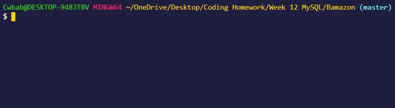
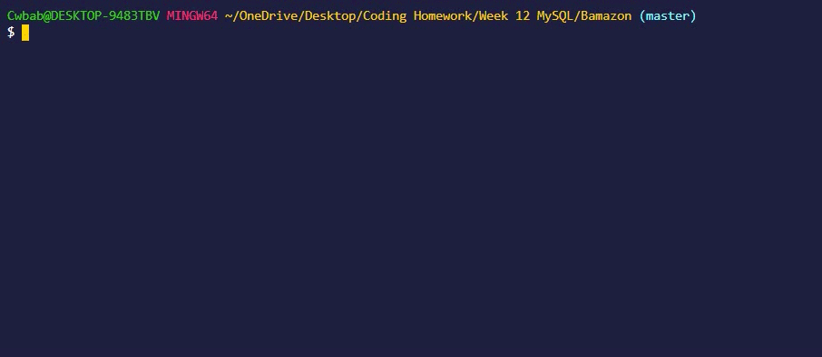
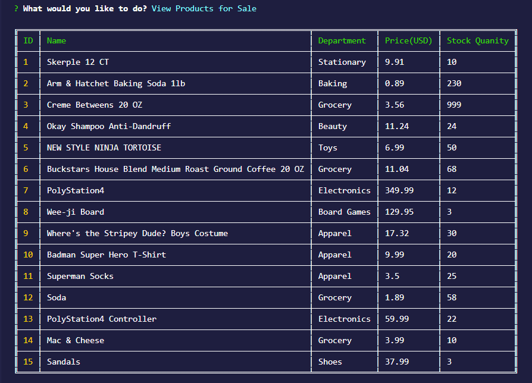
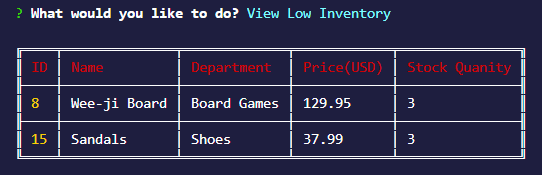
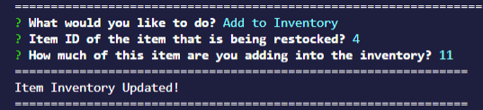
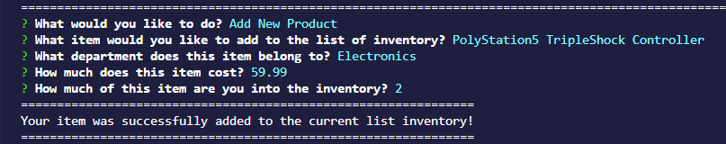

 
Bamazon Inc., offers a range of products and services through its command line terminal.

### How To Run Bamazon Manager App

Instructions:
1. Clone down the repository.
2. Navigate to the root of your project and run `npm install` to install all of the required node modules.

3. Run `npm start` in the terminal to bring up the main menu.

4. Below you will see 5 options that you can choose from:
    * `View Products for Sale`
    * `View Low Inventory`
    * `Add to Inventory`
    * `Add New Product`
    * `Exit`

### Detailed Instructions For Each Prompt
Option 1: `View Products for Sale`

This will go out to the Bamazon Database and return back a table with every single item we have available.

Option 2: `View Low Inventory`

This will go out to the Bamazon Database and return back a table with all of the items that are low in stock.

Option 3: `Add to Inventory`

This Option will prompt you to put in a couple values in order to add to the existing inventory.
    
  * First you must select the `Item ID` of the item you are updating
  * Next select `How Many` you want to add to the current stock.
    
The stock of the item will update and you'll see a preview of the updated table

Option 4: `Add New Product`

This Option will prompt you to put in value so that you can add an entirely new item to the inventory.

  * First you'll need to input a `Name` for the item.
  * Next enter which `Department` the item belongs to.
  * Then input the `Price` of the item. 
  * Lastly enter `How Many` you want to add into the Bamazon Database.
  
Congrats your `New` item is now in the current list of inventory!

Option 5: `Exit`

This option `Exits` out of the program.

### Built With
* Node.js
* JavaScript
* Node Package Manager (npm)
* MySQL

### NPM's Used
* [Colors](https://www.npmjs.com/package/colors) - Gets color and style into your node.js console.
* [Figlet](https://www.npmjs.com/package/figlet) - This project aims to fully implement the FIGfont spec in JavaScript.
* [Inquirer](https://www.npmjs.com/package/colors) - A collection of common interactive command line user interfaces.
* [MySQL](https://www.npmjs.com/package/colors) - This is a node.js driver for mysql.
* [Table](https://www.npmjs.com/package/table) - Produces a string that represents array data in a text table.

    

